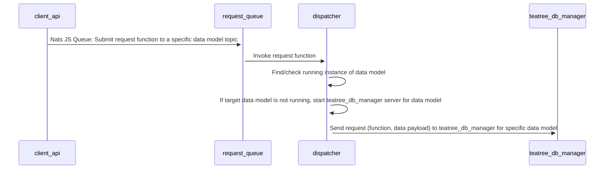
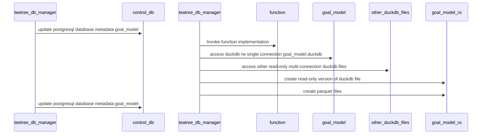
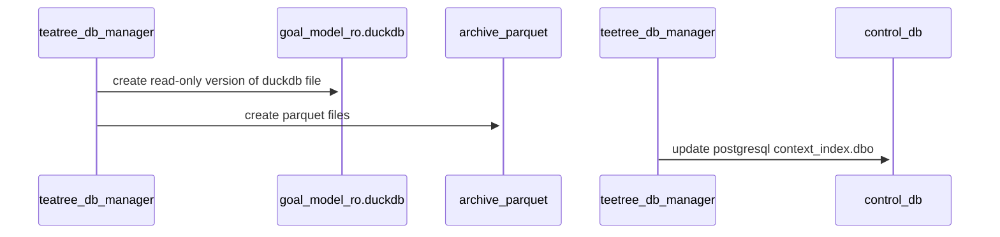
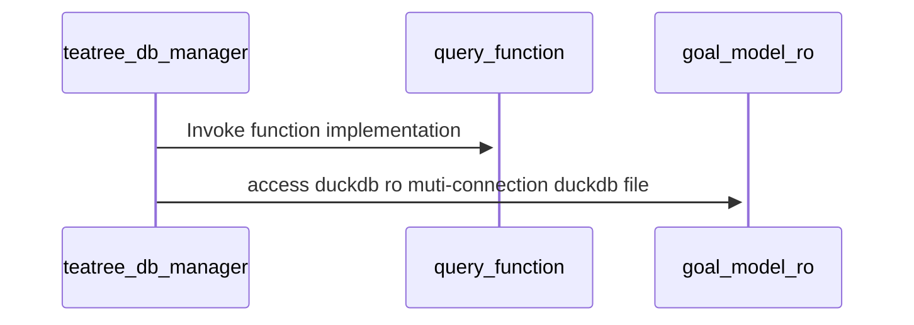
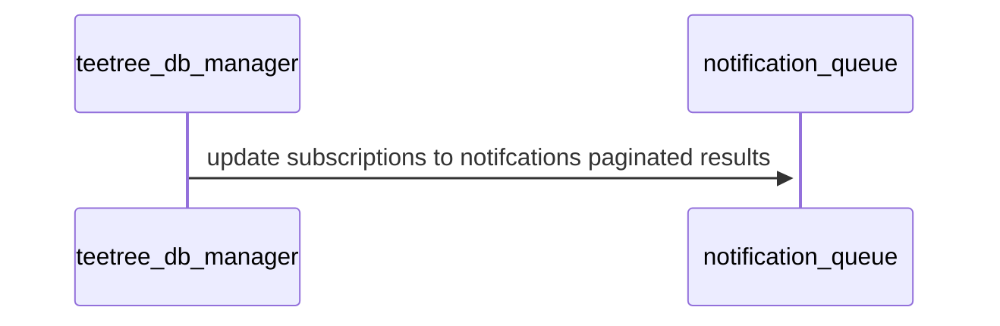

# Project Teatree

Teatree is a set of experimennts that illustate the use of Rust, [DuckDB](https://duckdb.org/), [Apache Arrow](https://arrow.apache.org/), and the [pola.rs dataframe library](https://www.pola.rs/) to build distributed compute engines. 

## Problem Statement 
Most ML pipeline are slow-moving and not real-time, primarily due to the research nature of many ML projects using Jupyter Notebooks. 
We want to build a high-performance compute data pipeline that ingests data, runs computation on the ingested data, and output results in near-realtime. 
- When input data, algorithms that operate on the knowing data models, and output data formats are known.

## Compare and contrast the following options

1. Rust with DuckDB
2. Rust, Pola.rs and Apache Arrow 

### Disadvantages of using DuckDB
- The [Rust DuckDB API](https://duckdb.org/docs/api/rust.html) is not as complete as the [C++ DuckDB API](https://duckdb.org/docs/api/cpp.html)
- Your algorithm is mainly in SQL versus Rust so you have limited observability in the performance and operation of your algorithm. 
- DuckDB is a single process, single file database. 
- You can only have a single read-write connection to a DuckDB file 
- DuckDB means you are writing lots of complex SQL. 

### Advantage of using DuckDB
- DuckDB is open to langauges  DuckDB support Python, Julia, Rust, Java, C++, R and more.
- DuckDB is open to formats. DuckDB can process Parquet, Arrrow, CSV, native DuckDB files and even Postgresql SQL data. 
- DuckDB is SQL so many more client side data engineers can create data transformations and simple analysis and algorithms in SQL. 
- We can keep an entire data model within a single DuckDB file, since DuckDB is a complete database. This allows us to version and ship a single DuckDB file versus multiple disparate datasets.
- You can maintain multiple connections to a read-only DuckDB file 
- DuckDB supports out of core memory-mapped datasets 

### Disadvantage of Pola.rs Apache Arrow dataframes
- With Pola.rs we are managing a filesystem of Apache Arrow files that represent our data model versus a single package. 
- Pola.rs documentation is sparse 
- Apache Arrow are immutable structures. If we have a mutation we need to write the entire frame back to disk. 

### Advantages of using Pola.rs Apache Arrow dataframes
- The entire solution is in Rust 
- We can add Open Telemetry tracing for each step of the algorithm written in Rust
- Pola.rs supports out of core memory-mapped datasets 

## Solution 
Lets support both options with our solution. 

### tea_tree_db_manager
- written as a Rust Server
- supports managing a directory of Apache Arrow datasets using Rust and Pola.rs
- supports managing (read-write) via a single connection a DuckDB file 
- support creating of duckdb versions that can be shipped to local edge points such as a user's laptop for analysis 
- supports a durable queue for inbound request services that result in mutating data as a set of functional intent-based services, for example updating data or invoking a compute job. 
- support a direct connection for read-requests
---
## We will start by showing the sequence diagrams for duckdb
- avoid the need for the facade/singleton pattern by having one file read-write serviced by a single queue and query to a read-only file for multi-user access. 

#### Mutations 
- client submits appends or updates or functions requests via a requst queue
- since we have a single process per request topic we do not need to write a speical facade or singleton pattern
- we update control tables in Postgresql: content_index, goal_model, and other tables 
- with the ability to have read-only access to supporting duckdb files we do not need to pass large blobs of data in our request queue

### Create ReadOnly versions
- we keep one version forward so that when we switch duckdb versions client UI's is not locked 
- we keep archives of the parquet files for each table in S3: folders corresponding to each goal_model_id

#### Query 
- we keep a separate versionized read-only duckdb file for multi-user reads 
- this keeps us from implementing a facade / singleton pattern 
- we update the read_only model everytime we do a write 

#### Notifications 
- When we finish a mutation or query we update the notifcation queue for clients subscribing to the request topic (ie: goal_model_id) 

---
## what about Pola.rs with Apache Arrow files 
- we store parquet files by sub-directory of the goal_model_id
- the files we save as parquet can be hydrated into apache arrow files (arrow2)
- we can then have functions that are written in Rust using pola.rs directly accessing arrow datasets  

## Kubernetes  

### storage 
- we store files in the shared Kubernetes files system Longhorn 
- we will use replication to ensure all files exist on all nodes 
- this means when we spin up a new node (machine) the startup time includes synchronizing the longhorn filessystem 
- each POD now has vCPU, RAM, and access to a persistent volume 

#### pod tpes 
- Machine types are determined via experimentation.  
- What is the goal_period timeframe?
- What is the basis_period timeframe? 
- how many sites?
- how many products?
- how many customers?
- how many salespersons?  

Here is how we start: 
- [ ] small: 2 vCPU, 2 GB RAM 
- [ ] medium: 4 vCPU 4 GB RAM 
- [ ] large: 8 vCPU  16 GB RAM 
- [ ] xlarge: 16 vCPU, 64 GB RAM 

